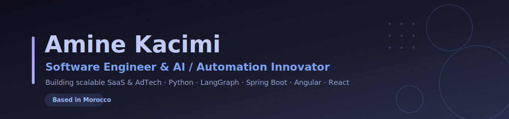

<!-- ====================== HEADER ====================== -->

# Hi, I'm Amine Kacimi 👋

 

<!-- ====================== ABOUT ====================== -->
## 👋 About Me

I'm **Amine Kacimi**, a **Software Engineer & AI/Automation Innovator** based in Morocco 🇲🇦, building **scalable SaaS & AdTech solutions**. I design and ship end-to-end applications — from Spring Boot & .NET back ends and REST/JWT-secured APIs to modern Angular and React front ends — and I love automating the repetitive parts with AI.

- 🔭 Currently leading development and shipping production features with a great team.
- 🤖 Exploring **AI integration & workflow automation** to make products smarter and ship faster.
- 🧩 I enjoy turning real-world problems into clean, maintainable, scalable software.
- 💬 Ask me about **Java / Spring Boot, Angular, React, or JWT authentication**.
- 📫 Reach me at **kacimi.aminee@gmail.com** or on [LinkedIn](https://www.linkedin.com/in/amine-kacimi).
- ⚡ Fun fact: I built a COVID-19 data-visualization app tracking cases across Moroccan cities.

<!-- ====================== TECH STACK ====================== -->
## 🛠️ Tech Stack

**Languages**

**Frameworks & Libraries**

**🤖 AI &amp; Automation**

**Databases & Cloud**

**Tools**

<!-- ====================== GITHUB STATS ====================== -->
## 📊 GitHub Stats

 

 

<!-- ====================== CONTACT ====================== -->
## 🤝 Let's Connect

I'm always open to collaborating on interesting projects, freelance work, or just talking tech.

---

<i>"First, solve the problem. Then, write the code."</i>

