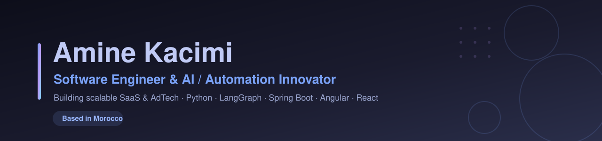

<!-- ====================== HEADER ====================== -->

# Hi, I'm Amine Kacimi 👋

 

<!-- ====================== ABOUT ====================== -->
## 👋 About Me

Software Engineer building **AI systems that ship** — autonomous agents, RAG pipelines and business process automation — on top of **5+ years of production software engineering**.

- 🤖 **Building** AI agents and agentic workflows, RAG knowledge bases, and **AI-powered financial automation** (invoice & receipt extraction, bank statement analysis, transaction reconciliation).
- 📏 I care about **evaluating** LLM systems, not just building them — golden sets, LLM-as-a-judge, regression gates before anything reaches production.
- 🏗️ **Team Leader** on an AdTech SaaS platform — winner of the **IAB MIXX Awards 2024 Gold**, Best International Marketing Tool.
- ⚙️ Comfortable across the whole chain: Spring Boot / Angular back & front ends, APIs, CI/CD, Docker, cloud.
- 💬 Ask me about **AI agents, RAG, LLM evaluation, prompt engineering** — or Spring Boot & Angular.
- 📫 Reach me at **kacimi.aminee@gmail.com** or on [LinkedIn](https://www.linkedin.com/in/amine-kacimi).

<!-- ====================== FEATURED WORK ====================== -->
## 🚀 Featured Work

Most of my recent work lives in **private client and company repositories**. Here's what I can share publicly:

<!--
  TODO — uncomment each row once the repo is public.
  Do not list anything here before it actually exists.

| Project | What it does | Stack |
|---|---|---|
| **[evalkit](https://github.com/Kacimi-Amine/evalkit)** | Pluggable LLM evaluation layer: golden sets, LLM-as-a-judge with bias controls, deterministic metrics and regression gates in CI. A new project plugs in with one `eval.yaml`. | Python · deepeval |
-->

> 🚧 Currently packaging my evaluation tooling into a public repo. Watch this space.

<!-- ====================== TECH STACK ====================== -->
## 🤖 AI & Automation

## 🛠️ Engineering

**Languages**

**Frameworks**

**Data & Cloud**

**DevOps & Tools**

<!-- ====================== GITHUB STATS ====================== -->
## 📊 GitHub Stats

<!-- ====================== CONTACT ====================== -->
## 🤝 Let's Connect

---

<i>"First, solve the problem. Then, write the code."</i>

